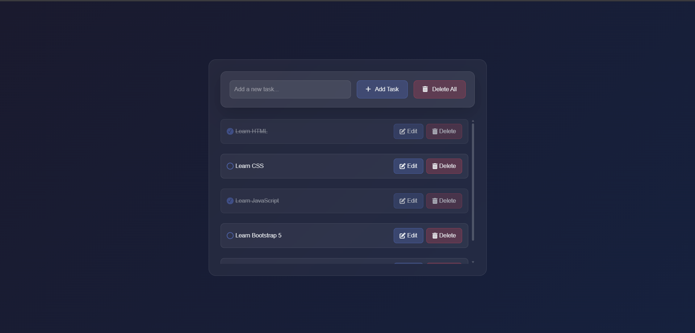

# 📝 To-Do List Web App

A modern and interactive **To-Do List** web application built using  
**HTML**, **CSS**, **JavaScript**, **Bootstrap 5**, and **Tailwind CSS**.  
The app allows you to add, edit, mark as done, and delete tasks — all with sound effects and local storage support 🪄✨

---

## 🚀 Live Demo
👉 [View the project](https://USERNAME.github.io/todo-list/)  
> Replace `USERNAME` with your GitHub username after enabling **GitHub Pages**.

---

## 📸 Preview
  
> (Optional) Add a screenshot of your app and name it `preview.png` inside the `assets` folder.

---

## 🧰 Technologies Used
- 🌐 **HTML5**  
- 🎨 **CSS3** + **Tailwind CSS** + **Bootstrap 5**  
- 🧠 **Vanilla JavaScript** (No frameworks)  
- 💾 **Local Storage** for saving tasks  
- 🔊 **Audio Feedback** for task actions (Add / Toggle / Delete)  
- 🪟 **SweetAlert2** for beautiful popups

---

## ✨ Features
- ➕ **Add new tasks** with one click.  
- ✍️ **Edit tasks** in a nice modal popup.  
- ✅ **Mark tasks as done** with a check animation and sound.  
- 🗑️ **Delete individual or all tasks** with confirmation alerts.  
- 💾 **Persistent data** stored in local storage.  
- 📱 **Responsive** design (mobile-friendly).  
- 🌀 **Modern UI** with glassmorphism and Tailwind utility classes.

---

## 📂 Project Structure
todo-project/
├─ index.html # Main HTML page
├─ style.css # Custom styles
├─ main.js # All app logic
├─ assets/ # Media assets
│ ├─ addTask.mp3
│ ├─ bubblepop.mp3
│ └─ delete.mp3
└─ README.md # Project documentation
